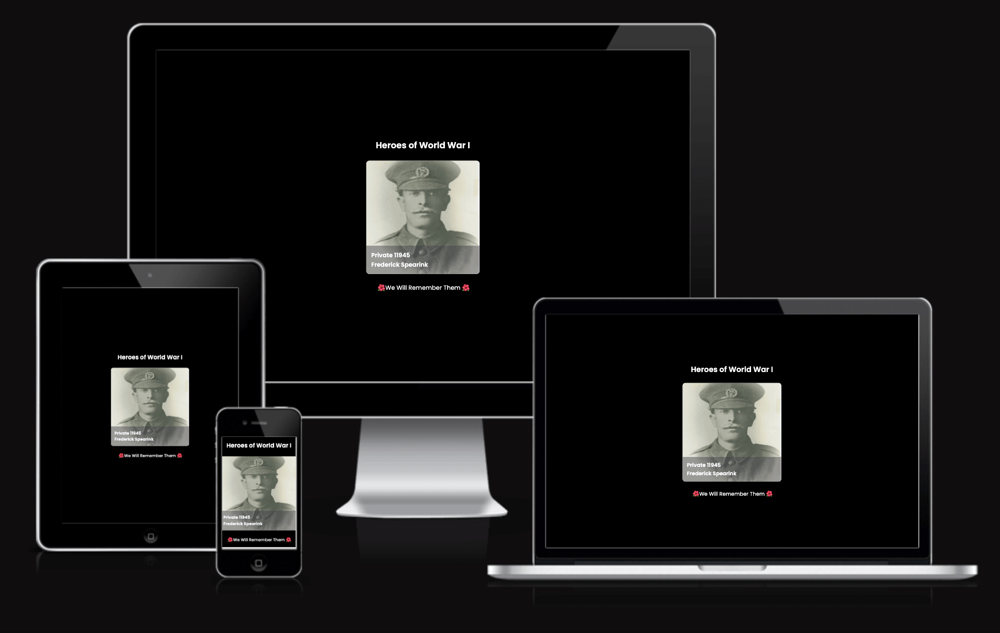
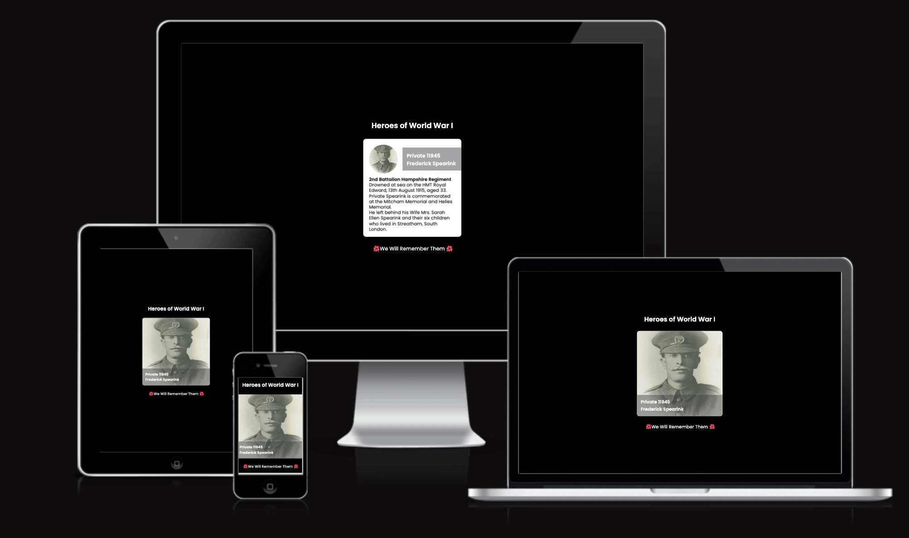
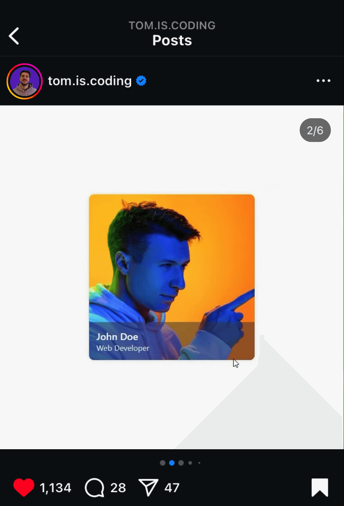
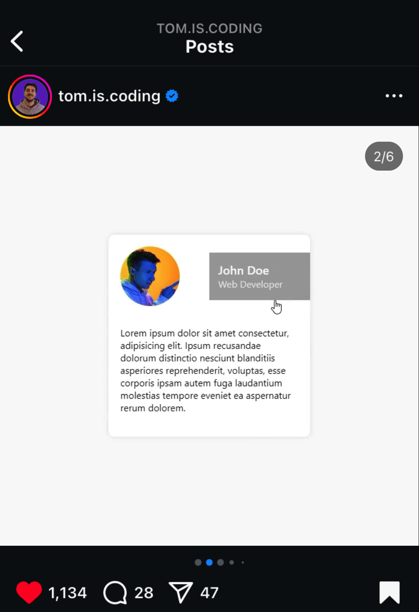

# Profile Card

This project has been created the code from [tom.is.coding](https://www.instagram.com/tom.is.coding?igsh=MWx6enkybTR0aGcweQ==) on Instagram who built a Profile Card. 

I have used SCSS and compiled this down to CSS in order to style the card and make this work as intended. I have also decided to add extra copy as a heading and footer to show how this could work as part of an element in a fully functioning web page (watch this space). 

If you would like to view my version of the profile card please [click here]()  

## Showcase
### Responsive Screenshot

### Responsive Screenshot - On Hover

## Acknowledgments 
A special thank you to: [tom.is.coding](https://www.instagram.com/tom.is.coding?igsh=MWx6enkybTR0aGcweQ==) who shared their code screenshots on Instagram, that has allowed me to undertake and complete this project.

The screenshots of the original from tom.is.coding are as shown below:
#### Before hover

#### On hover

A Special thank you to Brian Webb for submitting Private Frederick Spearink's photo and details online, without which I wouldn't have been able to trace our shared relative and War Hero.

A massive Thank you to all our War Heroes who gave their tomorrows for our todays. We owe them a huge debt of thanks and We Will Remember them, not just at Remembrance, but every day.